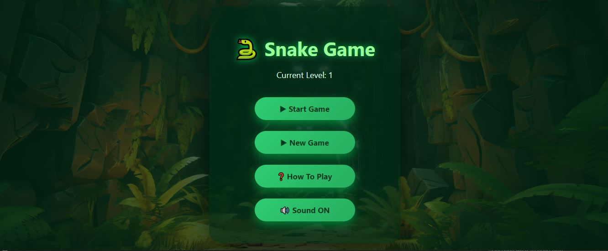
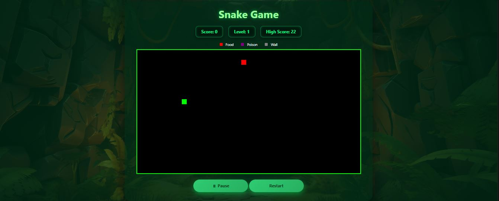
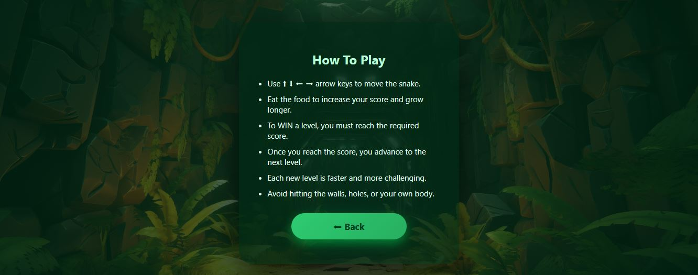
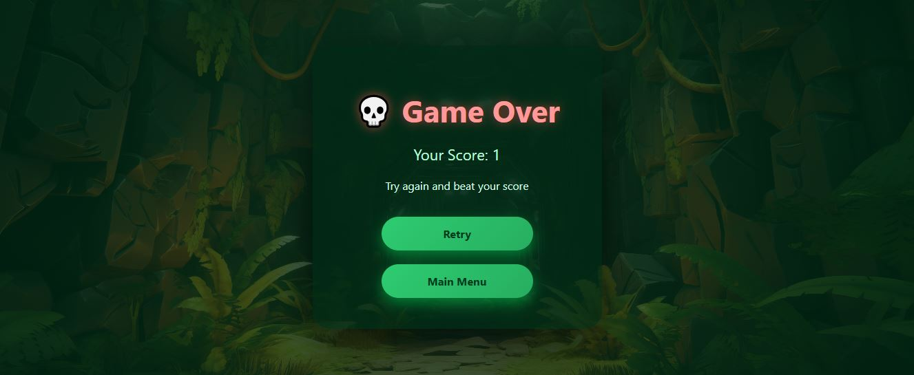

# 🐍 Snake Game

A modern, interactive Snake game built with JavaScript, HTML, and CSS. This project features multiple difficulty levels, sound effects, scoring system, and progressive obstacles.

## 🎮 Game Screenshots

### Main Menu


### Game Screen


### How to Play Page


### Game Over Screen


## 📋 Table of Contents

- [Features](#features)
- [Project Structure](#project-structure)
- [Game Levels](#game-levels)
- [How to Play](#how-to-play)
- [Controls](#controls)
- [Technologies Used](#technologies-used)
- [File Structure](#file-structure)

## ✨ Features

- **Multi-Level Gameplay**: 3 progressive difficulty levels
- **Dynamic Scoring System**: Score tracking with high score persistence
- **Sound Effects**: Background music and sound effects (toggleable)
- **Pause & Resume**: Pause the game at any time
- **Increasing Difficulty**: Speed increases with each level and score
- **Obstacles**: Walls that appear at higher levels
- **Poison Food**: Special hazard introduced in level 3
- **Persistent Data**: Uses localStorage to save progress, levels, and high scores
- **Responsive Controls**: Keyboard input with arrow keys
- **Visual Feedback**: Color-coded game elements and UI indicators

## 📁 Project Structure

```
Snake_GAME-main/
├── main_page/                 # Main menu
│   ├── index.html
│   ├── script.js
│   ├── style.css
│   ├── images/
│   └── sounds/
│       └── background.mp3
├── snake_game/                # Main game screen
│   ├── index.html
│   ├── script.js
│   ├── style.css
│   ├── images/
│   └── sounds/
│       ├── background.mp3
│       └── eat.mp3
├── how_to_play_page/          # Instructions page
│   ├── index.html
│   ├── script.js
│   ├── style.css
│   └── images/
├── game_over_page/            # Game over screen
│   ├── index.html
│   ├── script.js
│   ├── style.css
│   ├── sounds/
│   │   └── gameover.mp3
│   └── images/
└── README.md
```

## 🎮 Game Levels

### Level 1
- **Score Requirement**: 10 points to advance
- **Speed**: Medium 
- **Obstacles**: None
- **Special Items**: Regular food (red)

### Level 2
- **Score Requirement**: 30 points to advance
- **Speed**: Faster (speed increases with score)
- **Obstacles**: Walls appear progressively based on score
- **Special Items**: Regular food (red)
- **Wall Placement**: Dynamic wall generation

### Level 3
- **Score Requirement**: Ultimate challenge
- **Speed**: Very fast (speed increases significantly)
- **Obstacles**: More walls based on score
- **Special Items**: 
  - Regular food (red) - eat to gain points
  - Poison food (purple) - avoid at all costs

## 🎯 How to Play

1. **Start the Game**: 
   - Open the main menu from `main_page/index.html`
   - Click "Start Game" to continue from your last level or "New Game" to start fresh

2. **Objective**:
   - Control the snake using arrow keys
   - Eat the red food to increase your score and grow longer
   - Reach the required score for your current level to advance
   - Avoid walls, poison, and hitting your own body

3. **Win Condition**:
   - Complete all 3 levels or achieve the highest score possible
   - Leaderboard tracks your high score

4. **Controls**:
   - **Arrow Keys**: Move the snake (↑ ↓ ← →)
   - **Spacebar**: Pause/Resume
   - **Pause Button**: Click on-screen pause button
   - **Restart Button**: Restart the current level

## ⌨️ Controls

| Input | Action |
|-------|--------|
| `↑ Arrow Up` | Move snake up |
| `↓ Arrow Down` | Move snake down |
| `← Arrow Left` | Move snake left |
| `→ Arrow Right` | Move snake right |
| `Spacebar` | Pause/Resume game |
| Pause Button | Pause/Resume game |
| Restart Button | Reload current level |

## 🛠️ Technologies Used

- **HTML5**: Page structure and Canvas element
- **CSS**: Styling and responsive design
- **JavaScript**: Game logic, canvas rendering, event handling
- **HTML5 Audio API**: Sound effects and background music
- **localStorage API**: Data persistence (scores, levels, sound preferences)

## 📄 File Descriptions

### Main Page (`main_page/`)
- **index.html**: Menu screen with level display and action buttons
- **script.js**: 
  - Level tracking and display
  - Sound toggle functionality
  - Navigation between pages
  - Background music management
- **style.css**: Menu styling and layout

### Game Page (`snake_game/`)
- **index.html**: 
  - Canvas element (900x500px)
  - Game info display (score, level, high score)
  - Game legend (food, poison, wall colors)
  - Control buttons
- **script.js**: 
  - Core game logic and canvas rendering
  - Snake movement and growth mechanics
  - Collision detection
  - Level progression and difficulty scaling
  - Wall and poison food generation
  - Speed management
  - Sound effect triggering
  - Keyboard input handling
  - Pause/resume functionality
- **style.css**: Game layout and canvas styling

### How to Play Page (`how_to_play_page/`)
- **index.html**: Game instructions and rules
- **script.js**: Navigation back to menu
- **style.css**: Instructions page styling

### Game Over Page (`game_over_page/`)
- **index.html**: 
  - Final score display
  - Game over message
  - Retry and menu buttons
- **script.js**: 
  - Score display from localStorage
  - Navigation between pages
  - Game over sound effect
- **style.css**: Game over screen styling

## 🎵 Sound Files

The game includes the following audio files (located in respective `sounds/` folders):

- `background.mp3`: Background music for main menu and gameplay
- `eat.mp3`: Sound effect when snake eats food
- `gameover.mp3`: Sound effect when game ends

Sound can be toggled on/off from the main menu.

## 💾 Data Persistence

The game uses browser localStorage to save:
- `current-level`: Current game level (1-3)
- `high-score`: Highest score achieved
- `snakeScore`: Last game score
- `soundEnabled`: Sound preference (true/false)

This data persists across browser sessions, allowing players to:
- Resume from where they left off
- Track their best performance
- Maintain sound preferences

## 🎨 Visual Elements

### Game Color Scheme
- **Snake**: Lime green (changes to random colors per segment for visual effect)
- **Food**: Red
- **Poison**: Purple
- **Walls**: Gray
- **Canvas Background**: Light/neutral

### UI Elements
- **Buttons**: Interactive with hover effects
- **Text Display**: Score, level, and high score in real-time
- **Legend**: Color indicators for game elements

## 🐛 Known Features & Behaviors

- Snake segments change color randomly for visual appeal
- Speed starts at 150ms and decreases with each level and score gained
- Minimum speed is capped at 30ms to maintain game playability
- Walls are dynamically generated based on current score
- Game can be paused at any time using spacebar or pause button
- All game progress is automatically saved to localStorage

---

**Enjoy the game! 🎮** Try to beat your high score!
